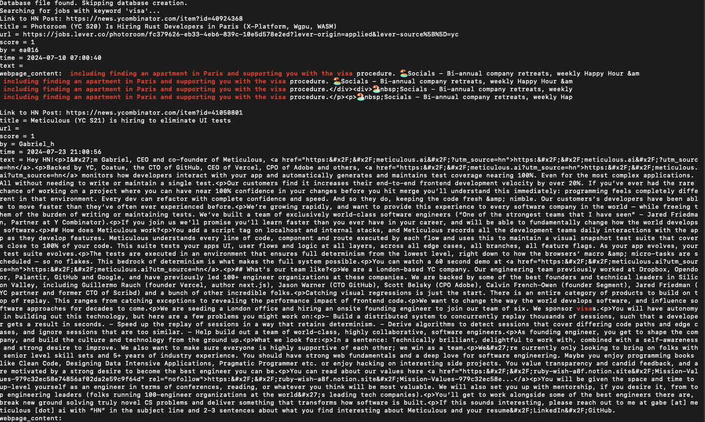

# HackerNews Jobs Fetcher

This is a shell script that fetches the latest job postings from Hacker News and stores them in a local SQLite database. It also allows you to search for job postings by keyword.

## Features

- Fetches the latest job postings from Hacker News
- Stores job details and webpage content in a local SQLite database
- Allows searching for job postings by keyword
- Displays search results with keyword highlighted
- Provides links back to the original Hacker News posts
- Avoids re-fetching job details if the URL has not changed

## Prerequisites

- Bash
- curl
- jq
- SQLite

## Installation

1. Clone this repository:
    ```sh
    git clone https://github.com/yourusername/hackernews-jobs-fetcher.git
    cd hackernews-jobs-fetcher
    ```

2. Ensure the script has executable permissions:
    ```sh
    chmod +x hackernews_jobs.sh
    ```

## Usage

### Fetching Jobs

To fetch the latest job postings from Hacker News and store them in the local database, run:

```sh
./hackernews_jobs.sh fetch
```

### Search Jobs

To fetch the latest job postings from Hacker News and store them in the local database, run:

```sh
./hackernews_jobs.sh search "keyword"
```

## Sample of output

